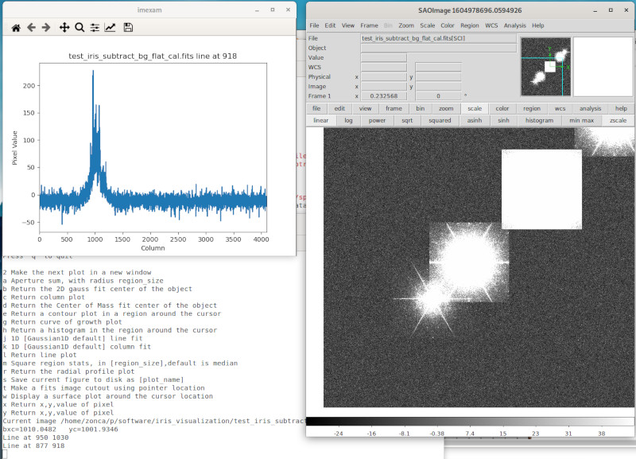
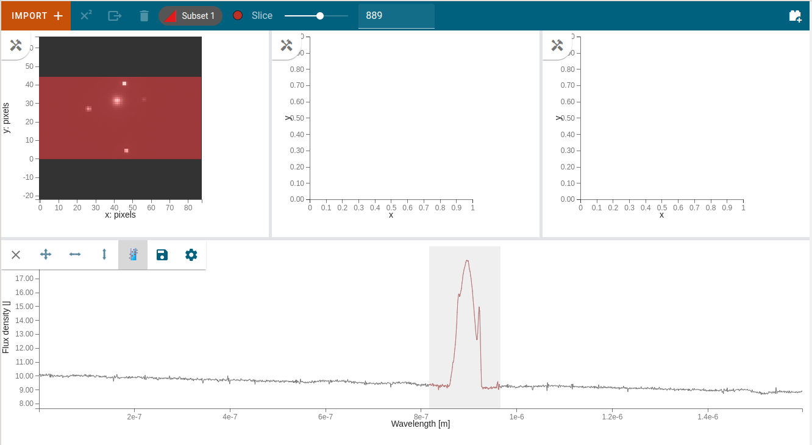

# Visualization for TMT IRIS

Real-time and offline visualization of IRIS data,
both data from the imagers and from the spectrometer.

## 2D visualization

### Test data

* [Raw science frame](https://figshare.com/s/83ccf1c457917e8c162f?file=17903858)
* [Reduced data](https://figshare.com/articles/dataset/test_iris_subtract_bg_flat_cal_fits/9942914)

### Launch 2D visualization

Currently we rely on the [JWST project `imexam`](https://github.com/spacetelescope/imexam) for visualizing 2D datasets, `imexam` has a programmatic interface to post-process data and interact with a GUI backend which can either be DS9 or Ginga (Browser-based).

See the [`launch_2d_imexam_ds9.py`](launch_2d_imexam_ds9.py) as an example, it could be automatically launched by the pipeline execution script `tmtrun` so that once a frame is reduced, it is automatically displayed inside DS9. Even after the image is in DS9, several algorithms can be executed from the command line to further process the image, see the [available algoritms](https://imexam.readthedocs.io/en/latest/index.html#user-documentation).

After the image appears on DS9, in the Python terminal type:

    viewer.imexam()

to load a menu of all different algorithms that can be executed.

See an example below of a IRIS reduced frame loaded in DS9 with the `imexam` menu open and a line plot.

## 3D visualization

[`Jdavis`](https://jdaviz.readthedocs.io/en/latest/index.html) is the new JWST python package which includes Cubeviz for visualizing data cubes from a spectrograph, SpecVis for 1D spectra and quick-look analysis and MOSViz for multi-object spectrographs.

### Install jdaviz

Create a dedicated `conda` environment by prefix or name with the requirements that need to be compiled:

    conda create --prefix=~/jdaviz -c glueviz -c conda-forge python==3.8 astropy glueviz voila glue-jupyter asteval
    conda create --name=jdaviz -c glueviz -c conda-forge python==3.8 astropy glueviz voila glue-jupyter asteval

Then install `jdaviz` with `pip`:

    pip install jdaviz
    
### Jdaviz on Galactica

    $ conda activate /data/software/repo/anaconda3/envs/jdaviz
    
After this you should have `jdaviz` in your path:

    $ which jdaviz                                                                                                         │·····
    /data/software/repo/anaconda3/envs/jdaviz/bin/jdaviz
    
Open an issue in this repository if the environment is broken.

### Test data

[On Figshare](https://figshare.com/articles/dataset/Jdaviz_IFU_test_files/13718131), I posted a simulated observation with the IRIS spectrograph (created by Nils-Erik Bjorn Rundquist).

### Launch 3D visualization

We can experiment with `Jdaviz` launching:

    jdaviz iris_cube_model.fits --layout=cubeviz

The `Jdaviz` allows to:

* go interactively thorugh all the slices
* select a subset of the data in pixel space or frequency bin
* apply a set of algorithms from the builtin library

See for example this screenshot (datasets had different shapes, the rest of the data is zeroed):

